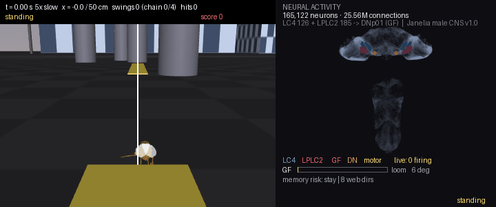
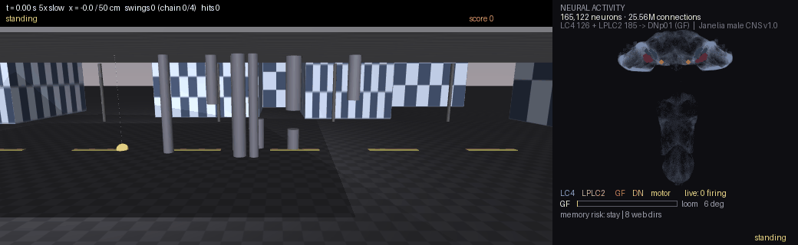
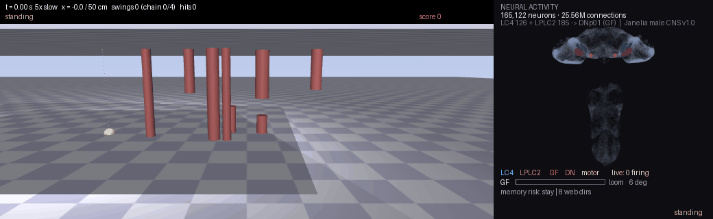

# fly-swing

*The panel on the right is the fly's whole nervous system, brain on top and nerve cord below. All 165,122 neurons and 25.6 million connections are simulated live. Blue and pink dots are the visual neurons charging up as something looms. When the giant fiber fires (red), the escape runs down to the motor neurons in the nerve cord (yellow).*

*The web is real physics. A rope that only pulls. Pull it in and the fly swings faster, like a child pumping a swing. Let go and it flies in an arc under gravity and air drag.*

A fruit fly, 1 mg and 2.5 mm long, swinging on webs like Spider-Man through an obstacle course in MuJoCo. **There is no dodge code.** The fly uses its own escape neuron, the giant fiber, and the 311 visual neurons that feed it. They come straight from the male fly connectome Janelia released this September. Their real synapse counts are the weights. When something looms, the giant fiber fires and 8 ms later the fly shoots a web and swings away. The whole connectome runs alongside as one network, fed what the fly sees, so what you see in the body is what the connectome does.

The reflex alone is late, so the fly also remembers. Every 10 ms it saves what it sees and where its web points, and later marks whether it got hit. **whitetree lets it ask, for eight web directions at once, how often that choice went wrong in situations like this one.** It takes the safest, and if staying put looks bad it swings before the giant fiber even fires.

## Limitations

The eye is a formula, not a simulation. One gain is tuned so the giant fiber fires near 40°, as in real flies. The whole-connectome network runs at 6 % synaptic strength, the largest value where a loom reaches the motor neurons and the activity then dies out. It runs 40x slower than the fly, so it is rendered offline, and it only watches. The web is made up. The memory has no counterpart in a real fly. The body is a 1 mg capsule that does not rotate.

## Built on

- **Janelia FlyEM male CNS connectome v1.0** (CC-BY 4.0, https://male-cns.janelia.org). The escape circuit, the whole-CNS network and the neuron positions.
- **whitetree** (MIT, https://github.com/whitetree-dev/whitetree). The memory.
- **MuJoCo** (Apache-2.0). Physics and rendering.
- **NeuroMechFly / flygym** (NeLy-EPFL, Apache-2.0). The fly meshes.
- Biology from von Reyn et al. 2014, Ache et al. 2019, Klapoetke et al. 2017 and Shiu et al. 2024.
